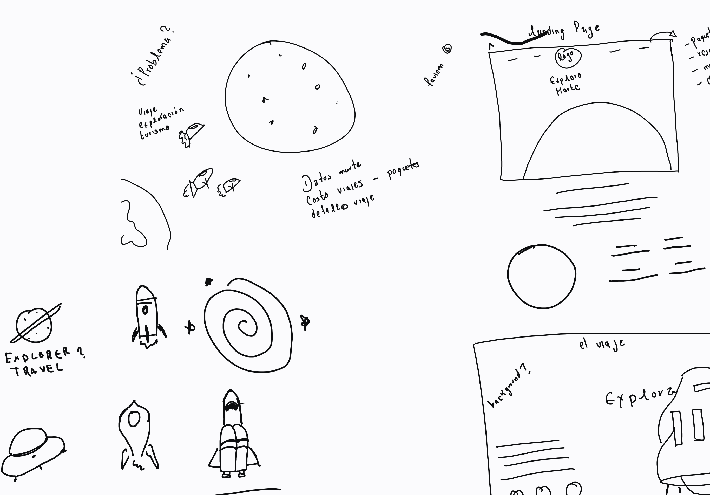
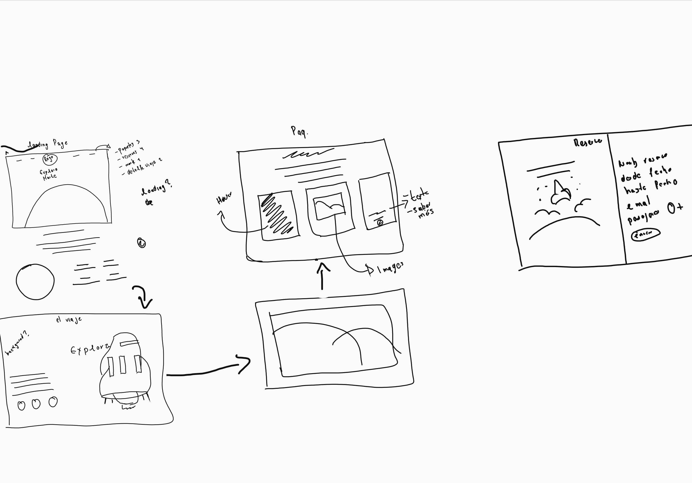

# Ucamp - Landing Page solution

## Table of contents

- [Overview](#overview)
  - [The challenge](#the-challenge)
  - [Screenshot](#screenshot)
  - [Links](#links)
- [My process](#my-process)
  - [Built with](#built-with)
  - [What I learned](#what-i-learned)
  - [Continued development](#continued-development)
  - [Useful resources](#useful-resources)
- [Author](#author)
- [Acknowledgments](#acknowledgments)

## Overview

### The challenge

Users should be able to:

- Landign page

### prototype



%208.35.09.png)

### Links

- Solution URL: [github](https://github.com/IvanSerranoGit/stats-pre-card-component)
- Live Site URL: [live site URL](https://ivanserranogit.github.io/stats-pre-card-component/)

## My process

### Built with

- Semantic HTML5 markup
- CSS custom properties
- Flexbox
- CSS Grid

### What I learned

Use this section to recap over some of your major learnings while working through this project. Writing these out and providing code samples of areas you want to highlight is a great way to reinforce your own knowledge.

To see how you can add code snippets, see below:

```html
  <header class='solar' id="inicio">
    <div class="text-exp">
      <h1 class="explora">Explora</h1>
      <p class="marte-text">Marte</p>
    </div>
    <button class="btn"> <a href="#viaje">Conoce más</a> </button>
    <div class='solar_systm'>
      <div class='planet mars'>
      </div>
    </div>
  </header>
```

```css
.solar{
  width: 100%;
  height: 100vh;
  display: flex;
  flex-direction: column;
}
.solar_systm{
  margin-top: -70px;
  height: 70vh;
  overflow: hidden;
}

.planet {
  box-sizing: border-box;
  margin: 120px auto;
  transform: translateY(-50%);
  height: 1200px;
  width: 1200px;
  border-radius: 600px;
  transition: transform 2.8s 0.23s cubic-bezier(0.33, 0, 0, 1), opacity 2s 0.8s, box-shadow 0s 0s;
}
@keyframes planet {
  from {
    background-position-y: 0px;
  }
  to {
    background-position-y: -1000px;
  }
}
.mars{
  transform: translateZ(0px) translateY(0) rotatex(4deg) scaleX(0.89);
  opacity: 2;
  animation: planet 60s 3.9s infinite linear;
}
 .planet {
  background: url("https://s3-us-west-2.amazonaws.com/s.cdpn.io/217233/mars_texture.jpg");
  box-shadow: 0 -590px 150px black inset, 0 0px 130px 40px #e86363 inset, 0 0px 23px 4px #e86363 inset, 0 -10px 130px #6b261a;
}
```

### Continued development

Use this section to outline areas that you want to continue focusing on in future projects. These could be concepts you're still not completely comfortable with or techniques you found useful that you want to refine and perfect.

**Note: Delete this note and the content within this section and replace with your own plans for continued development.**

### Useful resources

- [font awesome](https://fontawesome.com/icons) - icons
.

## Author

- Website - [Ivan Serrano](https://www.your-site.com)
- Instagram - [@opengalaxyz](https://www.instagram.com/opengalaxyz)
- Twitter - [@vanSerrano](https://twitter.com/lvanSerrano)

